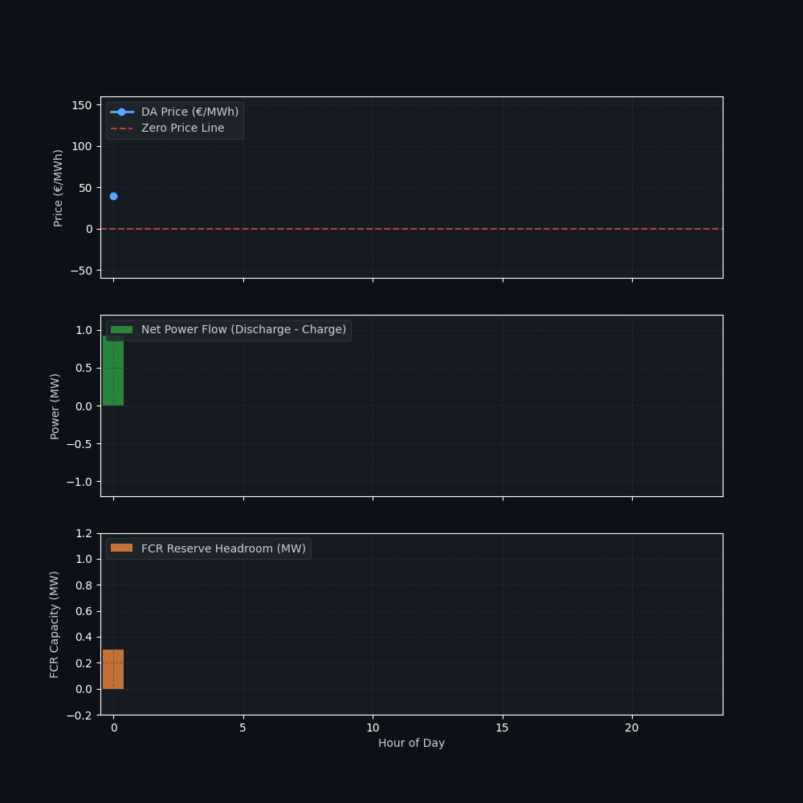

# Advanced BESS Multi-Market Co-Optimization (Day-Ahead + FCR)

An enterprise-grade quantitative optimization framework designed for Battery Energy Storage Systems (BESS) co-optimizing energy arbitrage in the European EPEX Spot market alongside Frequency Containment Reserve (FCR) capacity commitments in Germany.

The model solves complex Mixed-Integer Linear Programming (MILP) formulations to maximize total asset revenue while respecting simultaneous power headroom constraints, dynamic grid limits, and state-of-the-art battery degradation costs.

---

### Visualization

The optimization engine jointly manages energy discharge/charge schedules alongside dedicated FCR reserve capacity allocation across 24-hour horizons:

<p align="center">
  
</p>

---

### Sample Market Data & Constraints (`market_prices_co_optimization.csv`)

| Hour | DA Price (€/MWh) | FCR Price (€/MW) | Grid Limit (MW) | Description / Market Condition |
| :--- | :--- | :--- | :--- | :--- |
| **00:00** | 40.0 | 12.0 | 1.0 | Standard Base Load |
| **05:00** | -15.0 | 12.0 | 1.0 | Early morning negative pricing |
| **06:00** | -45.0 | 14.5 | 0.3 | Peak solar surge & grid congestion |
| **07:00** | -20.0 | 14.5 | 0.1 | Severe bottleneck (Minimum export) |
| **12:00** | 110.0 | 11.0 | 0.0 | Full grid curtailment (Zero export) |
| **19:00** | 150.0 | 15.0 | 1.0 | Evening peak demand window |

---

### Key Features
* **Multi-Market Revenue Stacking:** Simultaneously captures value from energy arbitrage (Day-Ahead) and capacity payments (FCR).
* **Joint Power Headroom Constraints:** Automatically ensures that inverter capacity is safely shared between energy dispatch and frequency regulation reserves ($P_{dispatch} + R_{fcr} \le P_{max}$).
* **Degradation-Aware Modeling:** Factoring in throughput wear-and-tear costs alongside binary mutual-exclusivity logic.
* **Dynamic Grid Injection Limits:** Adapts dispatch schedules to handle local distribution and transmission congestion limits.

---

### Project Structure
```text
bess-multi-market-optimizer/
│
├── data/
│   └── market_prices_co_optimization.csv
├── notebooks/
│   └── co_optimization_demo.ipynb
├── bess_co_optimization_dark.gif
├── README.md
└── requirements.txt
